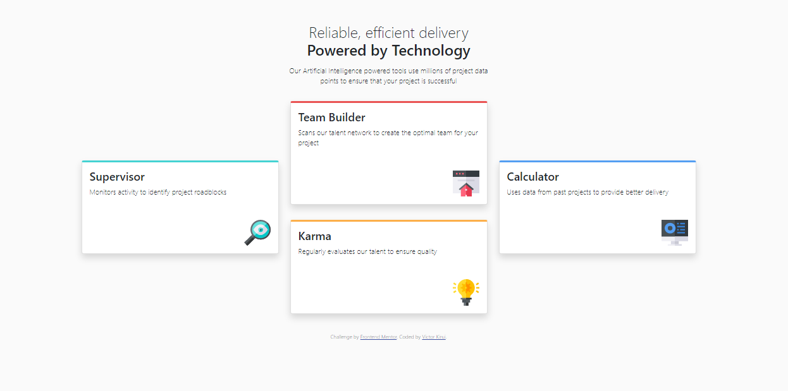

### The challenge

- build out feature section and get it looking as close to the design as possible.

Users should be able to:

- View the optimal layout for the site depending on their device's screen size

### Screenshot

### Links

- Solution URL: [Original Design](https://www.frontendmentor.io/challenges/four-card-feature-section-weK1eFYK)

### Built with

- HTML5 markup
- Bootstrap Flexbox
- Bootstrap CSS Grid
- Mobile-first workflow

### Useful resources

- [Bootstrap](https://getbootstrap.com/) - This helped with styling layouts.

## Author

- Frontend Mentor - [@victorkirui](https://www.frontendmentor.io/profile/victorkirui)

